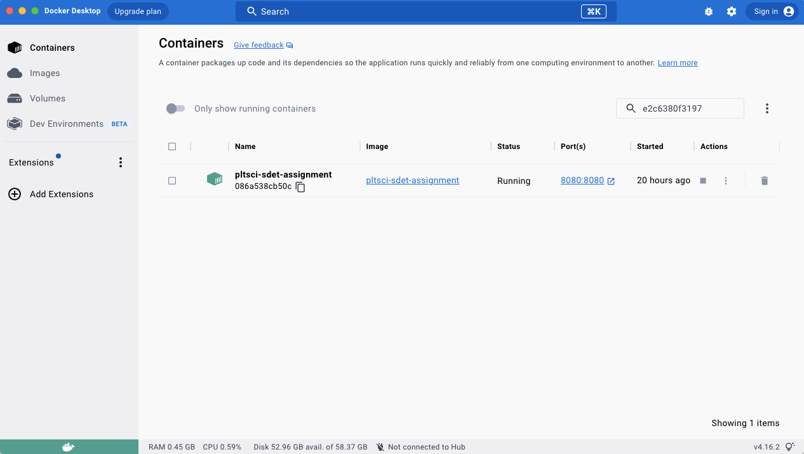
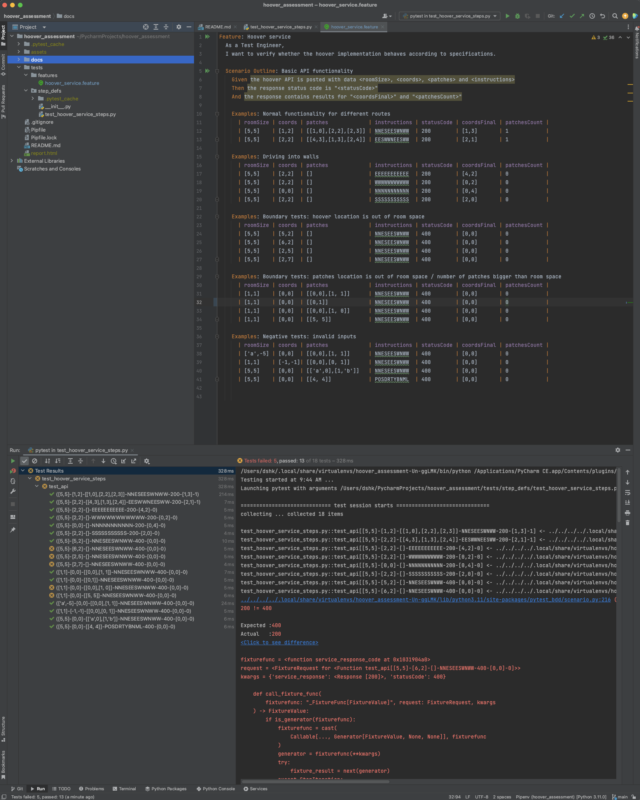
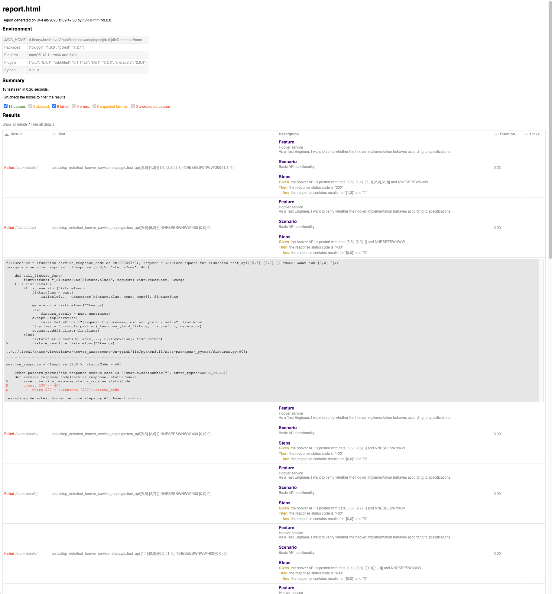

# SDET Coding Challenge

Coding challenge for positive/negative/boundary test cases to validate hoover functionality.

The test cases are designed to implement BDD approach by using Pytest-bdd framework and Gherkin language.

The project has been tested on the following resources:

* macOS Venture 13.0.1
* PyCharm 2022.3 (Community Edition)
* Python 3.11.0
* Pytest-bdd 6.11
* Pytest-bdd-html 0.1.14a0 for HTML report

## Requirements

Hoover service should be activated before test cases running.

Refer [Hoover Service Repository](https://bitbucket.org/platformscience/pltsci-sdet-assignment/src/main/) with the source code for details.

Follow the instructions below to resolve dependencies for testing environment:

```shell
# Install Python packages from Pipfile.lock
pip install pipenv
pipenv sync

# In case of installaton issues open Pipfile
# and follow packages section to resolve manually with the latest versions
[packages]
pytest = "*"
pytest-bdd = "*"
requests = "*"
pytest-bdd-html = "*"

```

## Usage

This is intended as a quick reference for starting a test environment:

```shell
# In case you use Pycharm, go to Settings > Python Integrated Tools, and set pytest as a default runner
# Or run tests in command line with logs, all file starting with "test_" prefix will be run automatically
pipenv run python -m pytest -v

# Run tests in command line and create HTML report
pipenv run python -m pytest -v --html=report.html
```

## Bugs found

<ins>Bug #1:</ins> API request counts dirt patches by hoovering but leaves them untouched,
so the next route counts the dirt patches from the previous request in case it hoovers them.

<ins>Bug #2:</ins>: given hoover X coordinate cannot be out of room space, given hoover Y coordinate cannot be equal or bigger then room space.
API response doesn't return proper output, expected a "Bad Request" message with status 400. 

<ins>Bug #3:</ins>: API response returns 200 status code for a request with number of dirt patches bigger then room size,  expected a "Bad Request" message with status 400.

<ins>Bug #4:</ins>: API response returns 200 status code for a request with coordinates of dirt patches out of room size,  expected a "Bad Request" message with status 400.

## Screenshots







